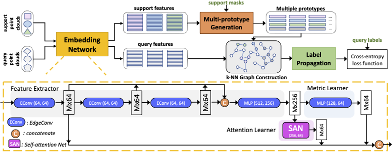
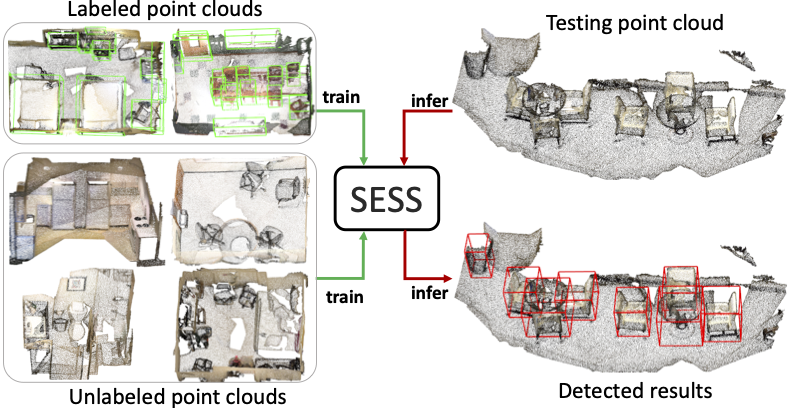
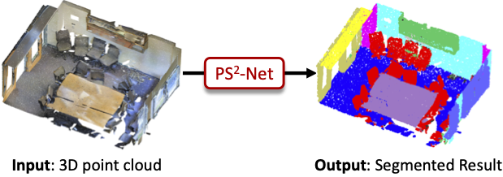

I am currently a Research Fellow working with [Assistant Professor Gim Hee Lee](https://www.comp.nus.edu.sg/~leegh/) in Computer Vision and Robot Perception (CVRP) Lab, Department of Computer Science, [National University of Singapore (NUS)](http://www.nus.edu.sg/). I did my Ph.D. from January 2017 to March 2021 at the Department of Computer Science, NUS, supervised by [Professor Tat-seng Chua](https://www.chuatatseng.com/) and co-supervised by [Assistant Professor Gim Hee Lee](https://www.comp.nus.edu.sg/~leegh/). 

My research interests include: (1) **Computer Vision**: 3D computer vision,  3D scene understanding, 3D object detection, 3D semantic segmentation. (2) **Machine Learning**: semi-supervised learning, few-shot learning, incremental learning, unsupervised/self supervised learning.

_______________________________________________________________________________________________________
<h3>
   Selected Publications
</h3>

 
            <table cellspacing="0" cellpadding="0" class="noBorder">
                <tbody>
	          <tr>
                    <td class="noBorder" width="40%">
                        
                            </td>
                    <td>
	                    <b>Few-shot 3D Point Cloud Semantic Segmentation </b>
	                     
	                    <strong>Na Zhao</strong>,Tat-Seng Chua, Gim Hee Lee. 
	                     
	                    <em>IEEE Conference on Computer Vision and Patten Recognition (CVPR), 2021 </em>
	                     
			    [<a href="https://arxiv.org/pdf/2006.12052.pdf">Paper</a>]
			    [<a href="https://github.com/Na-Z/attMPTI">Code</a>]
                    </td>
                </tr>
	          <tr>
                    <td width="40%">
                        
                            </td>
                    <td>
	                    <b>SESS: Self-Ensembling Semi-Supervised 3D Object Detection </b>
	                     
	                    <strong>Na Zhao</strong>,Tat-Seng Chua, Gim Hee Lee. 
	                     
	                    <em>IEEE Conference on Computer Vision and Patten Recognition (CVPR), 2020  </em><i style="color:#e74d3c">Oral Presentation</i>
	                     
			 [<a href="https://arxiv.org/pdf/1912.11803.pdf">Paper</a>]
			    [<a href="https://github.com/Na-Z/sess">Code</a>]
			    [<a href="https://www.youtube.com/watch?v=AGJsp4aksS0">Video</a>]
                    </td>
                </tr>
			  <tr>
                    <td width="40%">
                        
                            </td>
                    <td>
                        <b>PS^2-Net: A Locally and Globally Aware Network for Point-Based Semantic Segmentation</b>
                         
                        <strong>Na Zhao</strong>,Tat-Seng Chua, Gim Hee Lee.
                         
                        <em>25th International Conference on Pattern Recognition (ICPR), 2020 </em>
                         
			 [<a href="https://arxiv.org/pdf/1908.05425.pdf">Paper</a>] 
			 [<a href="https://github.com/Na-Z/PS-2Net">Code</a>]
			 [<a href="https://www.youtube.com/watch?v=IupewGCU0o8">Video</a>]
                    </td>
               </tr>  
            	</tbody>
            </table>

_______________________________________________________________________________________________________

<h3>
   Academic Experience
</h3>

      <ul>
         <li>Research Assistant. <a href="https://nextcenter.org/">NExT++ Rearch Center</a>, National University of Singapore. August 2015 - December 2016.</li>
      </ul>

      <ul>
         <li>Research Associate. <a>Computer Vision and Robotic Perception (CVRP) Laboratory</a>, National University of Singapore. January 2021 - March 2021.</li>
      </ul>

      <ul>
         <li>Research Fellow. <a>Computer Vision and Robotic Perception (CVRP) Laboratory</a>, National University of Singapore. April 2021 - Present.</li>
      </ul>

_______________________________________________________________________________________________________
<h3>
   Teaching Assistant
</h3>

  <ul>
  <li> CG3002 Embedded Systems Design Project (2017 Fall) </li>
  <li> CS4242 Social Media Computing (2018 Spring, 2019 Spring) </li>
  <li> CS5340 Uncertainty Modeling in AI (2018 Fall)  </li>
  </ul>

