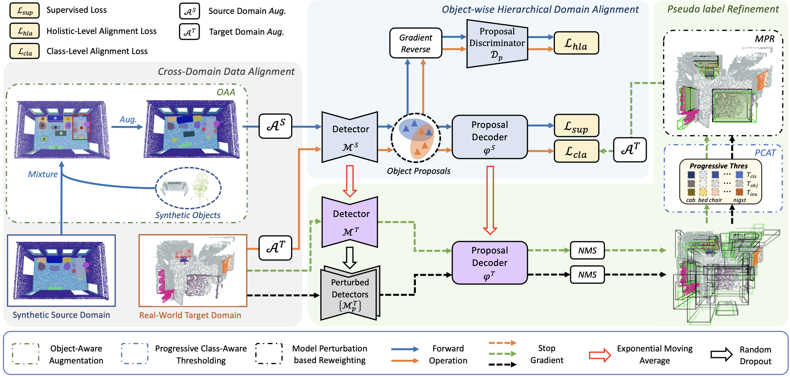
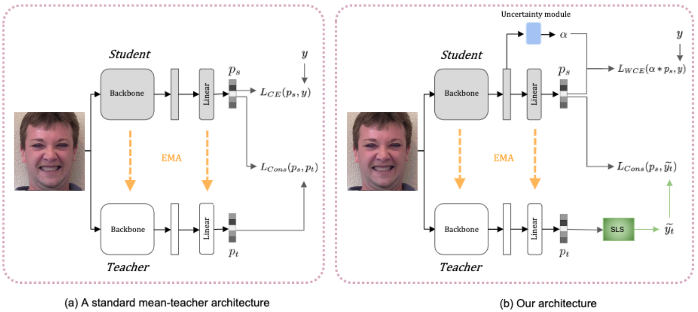

I am currently a tenure-track Assistant Professor in the Information Systems Technology and Design (ISTD) Pillar at [Singapore University of Technology and Design](https://www.sutd.edu.sg) (SUTD). Prior to joining SUTD, I was a Research Fellow in Computer Vision and Robot Perception Lab, Department of Computer Science, [National University of Singapore](http://www.nus.edu.sg/) (NUS). I recieved my Ph.D. in Computer Science from NUS in March 2021, supervised by [Professor Tat-Seng Chua](https://www.chuatatseng.com/). 

I am heading [Intelligent Machine Perception Lab](https://impl2023.github.io) (IMPL) at SUTD, with a primary focus on, but not limited to: (1) **Computer Vision**: 3D computer vision, (3D) scene understanding, 3D reconstruction. (2) **Machine Learning**: data-efficient learning, multi-modal learning, continual learning, out-of-distribution learning, robust learning.

_______________________________________________________________________________________________________
<h3>
   Open Positions
</h3>

 
  <ul>
  <li>I am looking for <strong>PhD applicants</strong> with strong background in computer science, fully-supported by <a href="https://sutd.edu.sg/Admissions/Graduate/Scholarships">SUTD</a>/<a href="https://aisingapore.org/research/phd-fellowship-programme/">AISG</a>/<a href="https://www.a-star.edu.sg/Scholarships/for-graduate-studies/singapore-international-graduate-award-singa">SINGA</a>/industry scholarship.</li>
  <li>I am recruiting <strong>research fellow</strong> (holds a doctoral degree) with relevant research experience on computer vision.</li>
  <li>I am welcoming self-fund or <a href="https://www.csc.edu.cn/chuguo/">CSC-fund</a> <strong>visiting PhD/Master students</strong> and <strong>local MComp/BComp students</strong> with interests in the area of (3D) computer vision and machine learning.</li>  
  </ul>
  <i>Please check <a href="https://impl2023.github.io/joinus">here</a> for more information, and feel free to reach out via email if you are interested in working with me.</i>

  

_______________________________________________________________________________________________________
<h3>
   News
</h3>

  <ul>
  <li> <strong>[Feb 2025]</strong> One paper about semi-supervised medical domain generalization is accepted by TMM 2025!</li> 
  <li> <strong>[Jan 2025]</strong> One paper about 3D reconstruction and editing is accepted by ICLR 2025!</li> 
  <li> <strong>[Dec 2024]</strong> One paper about 3D visual grounding is accepted by AAAI 2025!</li> 
  <li> <strong>[Dec 2024]</strong> One paper about class-incremental 3D object detection is accepted by TIP 2024!</li> 
  <li> <strong>[Nov 2024]</strong> I will serve as a senior PC for IJCAI 2025!</li> 
  <li> <strong>[Nov 2024]</strong> I am awarded a grant titled "<i>Bridging Language and Physical Real-world for 3D Reasoning and Object Manipulation</i>" from TL@SUTD as the sole Principal Investigator!</li>
  <li> <strong>[Oct 2024]</strong> I am invited to serve as Demo Chair at ACM Multimedia 2025!</li> 
  <li> <strong>[Oct 2024]</strong> One paper about open-set single-source domain generalization is accepted by TMM 2024!</li>
  <li> <strong>[Sep 2024]</strong> I am awarded a joint SMU-SUTD grant titled "<i>Synthesis and Resilience: Generative Models for Generalizable 3D World Understanding</i>" as the co-Principal Investigator!</li>
  <li> <strong>[Sep 2024]</strong> I will serve as an Area Chair for ICLR 2025!</li> 
  <li> <strong>[Aug 2024]</strong> I am awarded a MoE Tier 2 grant titled "<i>Empowering Real-World 3D Scene Understanding: Navigating Noise, Distribution Shifts, and Incremental Learning</i>" as the sole Principal Investigator!</li>
  <li> <strong>[Aug 2024]</strong> I am appointed as a Technical Committee member for IEEE-CAS Multimedia Systems and Applications!</li>
  <li> <strong>[Jul 2024]</strong> Two papers about domain generalized 3D semantic segmentation and UDA for 3D object detection are accepted by BMVC 2024!</li>
  <li> <strong>[Jul 2024]</strong> Two papers about generalizable neural semantic fields and point cloud representation learning are accepted by MM 2024!</li>
  <li> <strong>[Jul 2024]</strong> Two papers about open-vocabulary 3D object detection and 3D Gaussain splatting editing are accepted by ECCV 2024!</li>
  <li> <strong>[Jan 2024]</strong> One paper about language-guided 3D affordance segmentation is accepted by CVPR 2024!</li>
  <li> <strong>[Jan 2024]</strong> One paper about semi-supervised 3D instance segmentation is accepted by ICRA 2024!</li>
  <li> <strong>[Dec 2023]</strong> I am awarded a grant titled "<i>MANTIS - Cross-modality Resiliency against Real-world Attacks</i>" from DSO as the sole Principal Investigator!</li>
  <li> <strong>[Dec 2023]</strong> Two papers about semi-supervised 3D object detection and robust visual recognition are accepted by AAAI 2024!</li>
  <li> <strong>[Oct 2023]</strong> One paper about self-supervised point cloud representation learning is accepted by 3DV 2024 as an oral paper!</li>
  <li> <strong>[Sep 2023]</strong> One paper about visual domain generalization is accepted by IJCV 2023!</li>
  <li> <strong>[Aug 2023]</strong> One paper about robust few-shot point cloud segmentation is accepted by BMVC 2023!</li>
  <li> <strong>[Aug 2023]</strong> I am awarded a grant titled "<i>Towards Realistic Deep Learning for 3D Vision</i>" from A*STAR as the co-Investigator!</li>
  <li> <strong>[Jul 2023]</strong> One paper about generalized few-shot point cloud segmentation is accepted by ICCV 2023!</li>
  <li> <strong>[Jun 2023]</strong> One paper about 6-DoF grasps synthesis is accepted by IROS 2023!</li>
  <li> <strong>[May 2023]</strong> One paper about monocular 3D object detection is accepted by TCSVT 2023!</li>
  <li> <strong>[Mar 2023]</strong> I am invited to serve as Demo Chair at Sixth IEEE International Conference on Multimedia Information Processing and Retrieval (MIPR 2023)!</li>
  <li> <strong>[Feb 2023]</strong> I am invited to join the Organising Committee of IEEE ICME 2023 Workshop on 3D Multimedia Analytics, Search and Generation!</li>
  <li> <strong>[Oct 2022]</strong> I am awarded a grant titled "<i>Multi-modal Joint Learning for Scene Understanding</i>" from SUTD-ZJU IDEA as the sole Principal Investigator!</li>
  <li> <strong>[Sep 2022]</strong> I am awarded a grant titled "<i>Data-efficient 3D Object Detection for Robot Perception</i>" from TL@SUTD as the sole Principal Investigator!</li>
  <li> <strong>[Aug 2022]</strong> I join the Singapore University of Technology and Design as an Assistant Professor!</li>
  <li> <strong>[Jul 2022]</strong> Three papers are accepted by ECCV 2022!</li>
  <li> <strong>[Dec 2021]</strong> One paper about class-incremental 3D object detection is accepted by AAAI 2022 as an oral paper!</li>
  <li> <strong>[Jun 2021]</strong> I am selected for the CVPR 2021 Doctoral Consortium. My mentor is Prof. Serge Belongie!</li>
  <li> <strong>[May 2021]</strong> I win the <strong>IMDA Excellent Prize</strong> (best thesis) for my PhD thesis!</li>
  <li> <strong>[Mar 2021]</strong> I successfully defended my PhD thesis "Towards Learning Scene Semantics on 3D Point Clouds"!</li>
  <li> <strong>[Mar 2021]</strong> One paper about few-shot 3D semantic segmentation is accepted by CVPR 2021!</li>
  <li> <strong>[Aug 2020]</strong> I recieve the <strong>Research Achievement Award</strong> from SoC!</li>
  <li> <strong>[Feb 2020]</strong> One paper about semi-supervised 3D object detection is accepted by CVPR 2020 as an oral paper!</li>
  </ul>

_______________________________________________________________________________________________________
<h3>
   Selected Publications
</h3>
Please visit [my google scholar profile](https://scholar.google.com/citations?user=KOL2dMwAAAAJ&hl=en&oi=ao) for the full publication list.
 <i style="color:#0000FF; font-size:13.5px">* indicates corresponding author, and # indicates co-corresponding author</i>

 
        <table cellspacing="0" cellpadding="0" class="noBorder">
           <tbody>
          <tr>
                    <td class="noBorder" width="40%">
                        
                    </td>
                    <td>
                      <b>GaussianBlock: Building Part-Aware Compositional and Editable 3D Scene by Primitives and Gaussians</b>
                       
                      Shuyi Jiang, Qihao Zhao, Hossein Rahmani, De Wen Soh, Jun Liu, <strong>Na Zhao*</strong>
                       
                      <em>International Conference on Learning Representations (ICLR), 2025 </em> 
                       
                      [<a href="https://arxiv.org/abs/2410.01535">Paper</a>] [<a href="">Code</a>]
                    </td>
           </tr> 
          <tr>
                    <td class="noBorder" width="40%">
                        
                    </td>
                    <td>
                      <b>AugRefer: Advancing 3D Visual Grounding via Cross-Modal Augmentation and Spatial Relation-based Referring</b>
                       
                      Xinyi Wang, <strong>Na Zhao*</strong>, Zhiyuan Han, Dan Guo, Xun Yang
                       
                      <em>Thirty-Ninth AAAI Conference on Artificial Intelligence, 2025 </em> 
                       
                      [<a href="https://arxiv.org/pdf/2501.09428">Paper</a>] [<a href="">Code</a>]
                    </td>
           </tr> 
           <tr>
                    <td class="noBorder" width="40%">
                        
                    </td>
                    <td>
                      <b>Domain Expansion and Boundary Growth for Open-Set Single-Source Domain Generalization</b>
                       
                      Pengkun Jiao, <strong>Na Zhao#</strong>, Jingjing Chen#, Yu-Gang Jiang
                       
                      <em>IEEE Transactions on Multimedia (TMM), 2024 </em> 
                       
                      [<a href="https://arxiv.org/abs/2411.02920">Paper</a>] [<a href="">Code</a>]
                    </td>
           </tr> 
           <tr>
                    <td class="noBorder" width="40%">
                        
                    </td>
                    <td>
                      <b>GS^2-GNeSF: Geometry-Semantics Synergy for Generalizable Neural Semantic Fields</b>
                       
                      Chengshun Wang, <strong>Na Zhao*</strong>
                       
                      <em>ACM Multimedia (MM), 2024 </em> 
                       
                      [<a href="https://dl.acm.org/doi/abs/10.1145/3664647.3681156">Paper</a>] [<a href="">Code</a>]
                    </td>
          </tr> 
           <tr>
                    <td class="noBorder" width="40%">
                        
                    </td>
                    <td>
                      <b>On-the-fly Point Feature Representation for Point Clouds Analysis</b>
                       
                      Jiangyi Wang, Zhongyao Cheng, <strong>Na Zhao#</strong>, Jun Cheng, Xulei Yang#
                       
                      <em>ACM Multimedia (MM), 2024 </em> 
                       
                      [<a href="https://dl.acm.org/doi/pdf/10.1145/3664647.36807005">Paper</a>] [<a href="">Code</a>]
                    </td>
          </tr> 
          <tr>
                    <td class="noBorder" width="40%">
                        
                    </td>
                    <td>
                      <b>Unlocking Textual and Visual Wisdom: Open-Vocabulary 3D Object Detection Enhanced by Comprehensive Guidance from Text and Image</b>
                       
                      Pengkun Jiao, <strong>Na Zhao*</strong>, Jingjing Chen, Yu-Gang Jiang
                       
                      <em>European Conference on Computer Vision (ECCV), 2024 </em> 
                       
                      [<a href="https://arxiv.org/pdf/2407.05256">Paper</a>] [<a href="">Code</a>]
                    </td>
           </tr>
           <tr>
                    <td class="noBorder" width="40%">
                        
                    </td>
                    <td>
                      <b>View-Consistent 3D Editing with Gaussian Splatting</b>
                       
                      Yuxuan Wang, Xuanyu Yi, Zike Wu, <strong>Na Zhao</strong>, Long Chen, Hanwang Zhang
                       
                      <em>European Conference on Computer Vision (ECCV), 2024 </em> 
                       
                      [<a href="https://arxiv.org/abs/2403.11868">Paper</a>] [<a href="https://github.com/Yuxuan-W/vcedit">Code</a>]
                    </td>
              </tr>
            <tr>
                    <td class="noBorder" width="40%">
                        
                    </td>
                    <td>
                      <b>LASO: Language-guided Affordance Segmentation on 3D Object</b>
                       
                      Yicong Li, <strong>Na Zhao*</strong>, Junbin Xiao, Chun Feng, Xiang Wang, Tat-Seng Chua
                       
                      <em>IEEE Conference on Computer Vision and Pattern Recognition (CVPR), 2024 </em> 
                       
                      [<a href="https://openaccess.thecvf.com/content/CVPR2024/papers/Li_LASO_Language-guided_Affordance_Segmentation_on_3D_Object_CVPR_2024_paper.pdf">Paper</a>] [<a href="https://github.com/yl3800/LASO">Code</a>]
                    </td>
              </tr>
              <tr>
                    <td class="noBorder" width="40%">
                        
                    </td>
                    <td>
                      <b>End-to-End Semi-Supervised 3D Instance Segmentation with PCTeacher</b>
                       
                      Linfeng Li, <strong>Na Zhao*</strong>
                       
                      <em>IEEE International Conference on Robotics and Automation (ICRA), 2024 </em> 
                       
                      [<a href="https://ieeexplore.ieee.org/abstract/document/10610145">Paper</a>] [<a href="">Code</a>]
                    </td>
              </tr>
              <tr>
                    <td class="noBorder" width="40%">
                        
                    </td>
                    <td>
                      <b>Dual-Perspective Knowledge Enrichment for Semi-Supervised 3D Object Detection</b>
                       
                      Yucheng Han, <strong>Na Zhao*</strong>, Weiling Chen, Keng-Teck Ma, Hanwang Zhang   
                       
                      <em>Thirty-Eighth AAAI Conference on Artificial Intelligence, 2024 </em> 
                       
                      [<a href="https://arxiv.org/pdf/2401.05011.pdf">Paper</a>] [<a href="https://github.com/tingxueronghua/DPKE">Code</a>]
                    </td>
              </tr>
              <tr>
                    <td class="noBorder" width="40%">
                        
                    </td>
                    <td>
                      <b>Robust Visual Recognition with Class-Imbalanced Open-World Noisy Data</b>
                       
                      <strong>Na Zhao*</strong>, Gim Hee Lee
                       
                      <em>Thirty-Eighth AAAI Conference on Artificial Intelligence, 2024 </em> 
                       
                      [<a href="https://ojs.aaai.org/index.php/AAAI/article/view/29642">Paper</a>] [<a href="https://github.com/Na-Z/LIOND">Code</a>]
                    </td>
              </tr>
              <tr>
                    <td class="noBorder" width="40%">
                        
                    </td>
                    <td>
                      <b>SDCoT++: Improved Static-Dynamic Co-Teaching for Class-Incremental 3D Object Detection</b>
                       
                      <strong>Na Zhao</strong>, Peisheng Qian, Fang Wu, Xun Xu, Xulei Yang, Gim Hee Lee
                       
                      <em>IEEE Transactions on Image Processing (TIP), 2024 </em> 
                       
                      [<a href="https://ieeexplore.ieee.org/document/10819355">Paper</a>] [<a href="">Code</a>]
                    </td>
               </tr> 
              <tr>
                    <td class="noBorder" width="40%">
                        
                    </td>
                    <td>
                      <b>Syn-to-Real Unsupervised Domain Adaptation for Indoor 3D Object Detection</b>
                       
                      Yunsong Wang, <strong>Na Zhao</strong>, Gim Hee Lee 
                       
                      <em>The British Machine Vision Conference (BMVC), 2024 </em> 
                       
                      [<a href="https://arxiv.org/pdf/2406.11311">Paper</a>] [<a href="https://github.com/wangys16/OHDA">Code</a>]
                    </td>
              </tr>
              <tr>
                    <td class="noBorder" width="40%">
                        
                    </td>
                    <td>
                      <b>Synthetic-to-Real Domain Generalized Semantic Segmentation for 3D Indoor Point Clouds</b>
                       
                      Yuyang Zhao, <strong>Na Zhao</strong>, Gim Hee Lee 
                       
                      <em>The British Machine Vision Conference (BMVC), 2024 </em> 
                       
                      [<a href="https://arxiv.org/pdf/2212.04668">Paper</a>] [<a href="">Code</a>]
              </td>
              </tr>
              <tr>
                    <td class="noBorder" width="40%">
                        
                    </td>
                    <td>
                      <b>Enhancing Generalizability of Representation Learning for Data-Efficient 3D Scene Understanding</b>
                       
                      Yunsong Wang, <strong>Na Zhao</strong>, Gim Hee Lee 
                       
                      <em>International Conference on 3D Vision (3DV), 2024 </em> <i style="color:#e74d3c"> Oral Presentation </i>
                       
                      [<a href="https://ieeexplore.ieee.org/abstract/document/10550664">Paper</a>] [<a href="">Code</a>]
                    </td>
              </tr>
              <tr>
                    <td class="noBorder" width="40%">
                        
                    </td>
                    <td>
                      <b>Style-Hallucinated Dual Consistency Learning: A Unified Framework for Visual Domain Generalization</b>
                       
                      Yuyang Zhao, Zhun Zhong, <strong>Na Zhao</strong>, Nicu Sebe, Gim Hee Lee
                       
                      <em>International Journal on Computer Vision (IJCV), 2023 </em>
                       
                      [<a href="https://arxiv.org/pdf/2212.09068.pdf">Paper</a>] [<a href="https://github.com/HeliosZhao/SHADE-VisualDG">Code</a>]
                    </td>
              </tr>
              <tr>
                    <td class="noBorder" width="40%">
                        
                    </td>
                    <td>
                      <b>Towards Robust Few-shot Point Cloud Semantic Segmentation</b>
                       
                      Yating Xu, <strong>Na Zhao</strong>, Gim Hee Lee
                       
                      <em>The British Machine Vision Conference (BMVC), 2023 </em>
                       
                      [<a href="https://arxiv.org/pdf/2309.11228.pdf">Paper</a>] [<a href="https://github.com/Pixie8888/R3DFSSeg">Code</a>]
                    </td>
              </tr>
              <tr>
                    <td class="noBorder" width="40%">
                        
                    </td>
                    <td>
                      <b>Generalized Few-Shot Point Cloud Segmentation Via Geometric Words</b>
                       
                      Yating Xu, Conghui Hu, <strong>Na Zhao</strong>, Gim Hee Lee
                       
                      <em>International Conference on Computer Vision (ICCV), 2023 </em>
                       
                      [<a href="https://arxiv.org/pdf/2309.11222.pdf">Paper</a>] [<a href="https://github.com/Pixie8888/GFS-3DSeg_GWs">Code</a>]
                    </td>
              </tr>
              <tr>
                    <td class="noBorder" width="40%">
                        
                    </td>
                    <td>
                      <b>Refining 6-DoF Grasps with Context-Specific Classifiers</b>
                       
                      Tasbolat Taunyazov, Heng Zhang, John Patrick Eala, <strong>Na Zhao</strong>, Harold Soh
                       
                      <em>International Conference on Intelligent Robots and Systems (IROS), 2023 </em>
                       
                      [<a href="https://arxiv.org/pdf/2308.06928.pdf">Paper</a>] [<a href="https://github.com/tasbolat1/graspflow">Code</a>]
                    </td>
              </tr>
              <tr>
                    <td class="noBorder" width="40%">
                        
                    </td>
                    <td>
                      <b>PDR: Progressive Depth Regularization for Monocular 3D Object Detection </b>
                       
                      Hualian Sheng, Sijia Cai, <strong>Na Zhao</strong>#, Bing Deng, Min-Jian Zhao#, Gim Hee Lee
                       
                      <em>IEEE Transactions on Circuits and Systems for Video Technology (TCSVT), 2023 </em>
                       
                      [<a href="https://ieeexplore.ieee.org/abstract/document/10124735">Paper</a>]
                    </td>
              </tr>
              <tr>
                    <td class="noBorder" width="40%">
                        
                    </td>
                    <td>
                      <b>Teaching with Soft Label Smoothing for Mitigating Noisy Labels in Facial Expressions </b>
                       
                      Tohar Lukov, <strong>Na Zhao</strong>, Gim Hee Lee, Ser-Nam Lim
                       
                      <em>European Conference on Computer Vision (ECCV), 2022 </em>
                       
                      [<a href="https://www.ecva.net/papers/eccv_2022/papers_ECCV/papers/136720639.pdf">Paper</a>]
                      [<a href="https://github.com/toharl/soft">Code</a>]
                       
                    </td>
              </tr>  
              <tr>
                    <td class="noBorder" width="40%">
                        
                    </td>
                    <td>
                      <b>Rethinking IoU-based Optimization for Single-stage 3D Object Detection </b>
                       
                      Hualian Sheng, Sijia Cai, <strong>Na Zhao*</strong>, Bing Deng, Jianqiang Huang, Xian-Sheng Hua, Min-Jian Zhao, Gim Hee Lee 
                       
                      <em>European Conference on Computer Vision (ECCV), 2022 </em>
                       
                      [<a href="https://www.ecva.net/papers/eccv_2022/papers_ECCV/papers/136690536.pdf">Paper</a>]
                      [<a href="https://github.com/hlsheng1/RDIoU">Code</a>]
                    </td>
              </tr>
              <tr>
                    <td class="noBorder" width="40%">
                        
                    </td>
                    <td>
                       
                      <b>Style-Hallucinated Dual Consistency Learning for Domain Generalized Semantic Segmentation </b>
                       
                      Yuyang Zhao, Zhun Zhong, <strong>Na Zhao</strong>, Nicu Sebe, Gim Hee Lee
                       
                      <em>European Conference on Computer Vision (ECCV), 2022 </em>
                       
                      [<a href="https://www.ecva.net/papers/eccv_2022/papers_ECCV/papers/136880530.pdf">Paper</a>]
                      [<a href="https://github.com/HeliosZhao/SHADE">Code</a>]
                       
                    </td>
              </tr>
              <tr>
                    <td class="noBorder" width="40%">
                        
                    </td>
                    <td>
                       
                      <b>Static-Dynamic Co-Teaching for Class-Incremental 3D Object Detection </b>
                       
                      <strong>Na Zhao</strong>, Gim Hee Lee
                       
                      <em>Thirty-Sixth AAAI Conference on Artificial Intelligence, 2022 </em><i style="color:#e74d3c">Oral Presentation</i>
                       
                      [<a href="https://ojs.aaai.org/index.php/AAAI/article/view/20254">Paper</a>]
                      [<a href="https://github.com/Na-Z/SDCoT">Code</a>]
                       
                    </td>
              </tr>
	            <tr>
                    <td class="noBorder" width="40%">
                        
                    </td>
                    <td>
                       
	                    <b>Few-shot 3D Point Cloud Semantic Segmentation </b>
	                     
	                    <strong>Na Zhao</strong>, Tat-Seng Chua, Gim Hee Lee
	                     
	                    <em>IEEE Conference on Computer Vision and Pattern Recognition (CVPR), 2021 </em>
	                     
            			    [<a href="https://arxiv.org/pdf/2006.12052.pdf">Paper</a>]
            			    [<a href="https://github.com/Na-Z/attMPTI">Code</a>]
            			    <!---[<a href="https://www.youtube.com/watch?v=i5X1L1_03Rs">Video</a>]-->
                       
                    </td>
              </tr>
	            <tr>
                    <td width="40%">
                        
                    </td>
                    <td>
                       
	                    <b>SESS: Self-Ensembling Semi-Supervised 3D Object Detection </b>
	                     
	                    <strong>Na Zhao</strong>, Tat-Seng Chua, Gim Hee Lee
	                     
	                    <em>IEEE Conference on Computer Vision and Pattern Recognition (CVPR), 2020  </em><i style="color:#e74d3c">Oral Presentation</i>
	                     
			                [<a href="https://arxiv.org/pdf/1912.11803.pdf">Paper</a>]
            			    [<a href="https://github.com/Na-Z/sess">Code</a>]
            			    <!---[<a href="https://www.youtube.com/watch?v=AGJsp4aksS0">Video</a>]-->
                       
                    </td>
              </tr>
			        <tr>
                    <td width="40%">
                        
                    </td>
                    <td>
                         
                        <b>PS^2-Net: A Locally and Globally Aware Network for Point-Based Semantic Segmentation</b>
                         
                        <strong>Na Zhao</strong>, Tat-Seng Chua, Gim Hee Lee
                         
                        <em>25th International Conference on Pattern Recognition (ICPR), 2020 </em>
                         
                  			[<a href="https://arxiv.org/pdf/1908.05425.pdf">Paper</a>] 
                  			[<a href="https://github.com/Na-Z/PS-2Net">Code</a>]
                  			<!---[<a href="https://www.youtube.com/watch?v=IupewGCU0o8">Video</a>]-->
                         
                    </td>
               </tr>  
            	</tbody>
            </table>

_______________________________________________________________________________________________________

<h3>
   Research Grants
</h3>

      <ul>
      <li>Principal Investigator. TL@SUTD Seed Grant. S$200,000. Mar 2025 - Mar 2027.
        Topic: <i>Bridging Language and Physical Real-world for 3D Reasoning and Object Manipulation</i>
       </li> 
       <li>Principal Investigator. MoE Tier 2 Research Grant. S$994,411. Feb 2025 - Feb 2028.
        Topic: <i>Empowering Real-World 3D Scene Understanding: Navigating Noise, Distribution Shifts, and Incremental Learning</i>
       </li>   
       <li>Co-Principal Investigator. SMU-SUTD Joint Research Grant. S$125,000. Nov 2024 - Oct 2026.
        Topic: <i>Synthesis and Resilience: Generative Models for Generalizable 3D World Understanding</i>
        Principal Investigator: <a href="https://panzhous.github.io">Prof. Zhou Pan</a>, Singapore Management University (SMU)
       </li>   
       <li>Principal Investigator. DSO Research Grant. S$998,000. Dec 2023 - Dec 2026.
        Topic: <i>Cross-modality Resiliency against Real-world Attacks</i>
       </li>
       <li>Co-Investigator. A*STAR MTC Programmatic Grant. S$599,950. Aug 2023 - Jul 2026.
        Topic: <i>Towards Realistic Deep Learning for 3D Vision</i>
       </li>
       <li>Principal Investigator. SUTD-ZJU Thematic Research Grant. S$148,187. Dec 2022 - Nov 2024.
        Topic: <i>Multi-modal Joint Learning for Scene Understanding</i>
        Collaborator: <a href="https://yiyiliao.github.io">Prof. Liao Yiyi</a>, Zhejiang University (ZJU)
       </li>
       <li>Principal Investigator. TL@SUTD Seed Grant. S$85,000. Oct 2022 - Apr 2024.
        Topic: <i>Data-efficient 3D Object Detection for Robot Perception</i>
      </li>
      </ul>

_______________________________________________________________________________________________________

<h3>
   Academic Experience
</h3>

      <ul>
       <li>Research Fellow. <a>Computer Vision and Robotic Perception Laboratory</a>, NUS. Apr 2021 - Jul 2022.</li>
       <li>Research Associate. <a>Computer Vision and Robotic Perception Laboratory</a>, NUS. Jan 2021 - Mar 2021.</li>
       <li>Research Assistant. <a href="https://nextcenter.org/">NExT++ Rearch Center</a>, NUS. Aug 2015 - Dec 2016.</li>
      </ul>

_______________________________________________________________________________________________________
<h3>
   Academic Services
</h3>

  <ul>
  <li> <strong>Conference Reviewer</strong>: CVPR, ICCV, ECCV, NeurIPS, ICML, ICLR, AAAI, IJCAI, MM, BMVC, etc</li>
  <!---NeurIPS 2023-2024, ECCV 2024, ICML 2024, CVPR 2021-2024, ICLR 2024, IJCAI 2021-2024, ICCV 2023, AAAI 2021-2023, BMVC 2022, ECCV 2022, ICCV 2021, MM 2019-2020, PCM 2018-->
  <li> <strong>Journal Reviewer</strong>: TPAMI, TIP, TKDE, TCSVT, TOMM, TMM, Multimedia Systems, Neurocomputing, etc</li>
  <!---Transactions on Knowledge and Data Engineering, Transactions on Image Processing, Transactions on Circuits and Systems for Video Technology, Pattern Recognition, Transactions on Multimedia Computing, Communications, and Applications, Journal of Photogrammetry and Remote Sensing, Transactions on Multimedia, Multimedia Systems, Neurocomputing, Journal of Visual Communication and Image Representation-->
  <li> <strong>Organizer</strong>: The 34th ACM International Conference on Multimedia 2025 (Demo Chair), The 6th IEEE International Conference on Multimedia Information Processing and Retrieval 2023 (Demo Chair), The 2nd ICME Workshop on 3D Multimedia Analytics, Search and Generation (Chair), The 22nd international conference on Multimedia Modeling (Publication Chair)</li>
  <li> <strong>Technical Committee Member</strong>: IEEE-CAS Multimedia Systems & Applications (2024-2028)</li>
  <li> <strong>Conference Area Chair (AC)</strong>: ICLR 2025</li>
  <li> <strong>Conference Senior Program Committee (PC) Member</strong>: IJCAI 2025</li>
  </ul>

_______________________________________________________________________________________________________
<h3>
   Teaching Experience
</h3>

  <ul>
  <li> Mentor, 01.400 Capstone (2), Fall 2024 & Spring 2025 </li>
  <li> Instructor, 50.007 Machine Learning, Spring 2023 & Spring 2024 & Spring 2025. </li>
  <li> Mentor, 01.400 Capstone (11), Fall 2023 & Spring 2024. </li>
  <li> Instructor, 10.020 Data Driven World, Fall 2023. </li>
  <li> Teaching Assistant, CS4242 Social Media Computing, Spring 2018 & Spring 2019.</li>
  <li> Teaching Assistant, CS5340 Uncertainty Modeling in AI, Fall 2018.  </li>
  <li> Teaching Assistant, CG3002 Embedded Systems Design Project, Fall 2017. </li>
  </ul>

