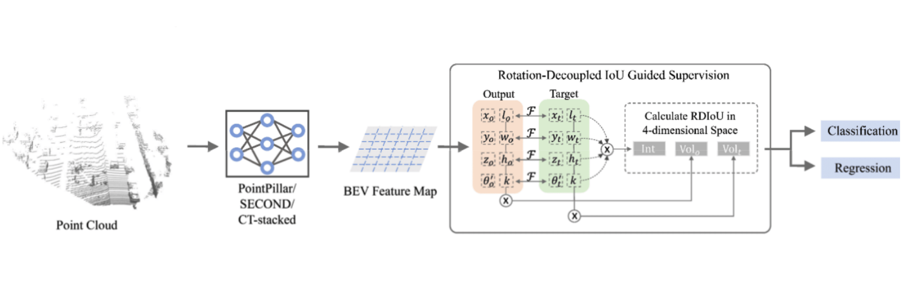

I am currently an Assistant Professor in the Information Systems Technology and Design (ISTD) Pillar at [Singapore University of Technology and Design](https://www.sutd.edu.sg) (SUTD). Prior to joining SUTD, I was a Research Fellow working with [Associate Professor Gim Hee Lee](https://www.comp.nus.edu.sg/~leegh/) in Computer Vision and Robot Perception Lab, Department of Computer Science, [National University of Singapore](http://www.nus.edu.sg/) (NUS). I recieved my Ph.D. in Computer Science from NUS in March 2021, supervised by [Professor Tat-Seng Chua](https://www.chuatatseng.com/) and worked closely with Associate Professor Gim Hee Lee. 

My research interests include, but are not limited to: (1) **Computer Vision**: 3D computer vision,  (3D) scene understanding such as object detection and semantic segmentation. (2) **Machine Learning**: data-efficient learning such as semi-supervised learning and few-shot learning, continual/incremental learning, robust learning, out-of-distribution learning.

_______________________________________________________________________________________________________
<h3>
   Open Positions
</h3>

 
  <ul>
  <li>I am looking for <strong>PhD applicants</strong> with strong backgrounds in computer science, fully-supported by <a href="https://sutd.edu.sg/Admissions/Graduate/Scholarships">SUTD</a>/<a href="https://aisingapore.org/research/aisg-phd-fellowship-programme/">AISG</a>/<a href="https://www.a-star.edu.sg/Scholarships/for-graduate-studies/singapore-international-graduate-award-singa">SINGA</a> scholarship.</li>
  <li>I am recruiting <strong>research fellow</strong> (with doctoral degree), <strong>research associate</strong> (with master degree) and <strong>research assistant</strong> (with bachelor/master degree) with relevant research experience on computer vision.</li>
  <li>I am welcoming self-fund <strong>visiting PhD/Master/UnderGrad students</strong> and <strong>MComp/BComp students</strong> from local universities in Singapore with interests in the area of (3D) computer vision and machine learning.</li>  
  </ul>
  <i>Please contact me via email if you are interested to work with me at SUTD.</i>

  

_______________________________________________________________________________________________________
<h3>
   News
</h3>

  <ul>
  <li> <strong>[Aug 2022]</strong> I join the Singapore University of Technology and Design as an Assistant Professor!</li>
  <li> <strong>[Jul 2022]</strong> Three papers are accepted by ECCV 2022!</li>
  <li> <strong>[Dec 2021]</strong> One paper about class-incremental 3D object detection is accepted by AAAI 2022 as an oral paper!</li>
  <li> <strong>[Jun 2021]</strong> I am selected for the CVPR 2021 Doctoral Consortium. My mentor is Prof. Serge Belongie!</li>
  <li> <strong>[May 2021]</strong> I win the <strong>IMDA Excellent Prize</strong> for my PhD thesis!</li>
  <li> <strong>[Mar 2021]</strong> I successfully defended my PhD thesis "Towards Learning Scene Semantics on 3D Point Clouds"!</li>
  <li> <strong>[Mar 2021]</strong> One paper about few-shot 3D semantic segmentation is accepted by CVPR 2021!</li>
  <li> <strong>[Aug 2020]</strong> I recieve the <strong>Research Achievement Award</strong> from SoC!</li>
  <li> <strong>[Feb 2020]</strong> One paper about semi-supervised 3D object detection is accepted by CVPR 2020 as an oral paper!</li>
  </ul>

_______________________________________________________________________________________________________
<h3>
   Selected Publications
</h3>
<i>Please visit [my google scholar profile](https://scholar.google.com/citations?user=KOL2dMwAAAAJ&hl=en&oi=ao) for the full publication list.</i>

 
        <table cellspacing="0" cellpadding="0" class="noBorder">
           <tbody>
              <tr>
                    <td class="noBorder" width="40%">
                        
                    </td>
                    <td>
                      <b>Rethinking IoU-based Optimization for Single-stage 3D Object Detection </b>
                       
                      Hualian Sheng, Sijia Cai, <strong>Na Zhao*</strong>, Bing Deng, Jianqiang Huang, Xian-Sheng Hua, Min-Jian Zhao, Gim Hee Lee 
                      <i style="color:#e74d3c">* indicates corresponding author</i>
                       
                      <em>European Conference on Computer Vision (ECCV), 2022 </em>
                       
                      [<a href="https://www.ecva.net/papers/eccv_2022/papers_ECCV/papers/136690536.pdf">Paper</a>]
                      [<a href="https://github.com/hlsheng1/RDIoU">Code</a>]
                    </td>
              </tr>
              <tr>
                    <td class="noBorder" width="40%">
                        
                    </td>
                    <td>
                      <b>Teaching with Soft Label Smoothing for Mitigating Noisy Labels in Facial Expressions </b>
                       
                      Tohar Lukov, <strong>Na Zhao</strong>, Gim Hee Lee, Ser-Nam Lim
                       
                      <em>European Conference on Computer Vision (ECCV), 2022 </em>
                       
                      [<a href="https://www.ecva.net/papers/eccv_2022/papers_ECCV/papers/136720639.pdf">Paper</a>]
                      [<a href="https://github.com/toharl/soft">Code</a>]
                       
                    </td>
              </tr>  
              <tr>
                    <td class="noBorder" width="40%">
                        
                    </td>
                    <td>
                       
                      <b>Style-Hallucinated Dual Consistency Learning for Domain Generalized Semantic Segmentation </b>
                       
                      Yuyang Zhao, Zhun Zhong, <strong>Na Zhao</strong>, Nicu Sebe, Gim Hee Lee
                       
                      <em>European Conference on Computer Vision (ECCV), 2022 </em>
                       
                      [<a href="https://www.ecva.net/papers/eccv_2022/papers_ECCV/papers/136880530.pdf">Paper</a>]
                      [<a href="https://github.com/HeliosZhao/SHADE">Code</a>]
                       
                    </td>
              </tr>
              <tr>
                    <td class="noBorder" width="40%">
                        
                    </td>
                    <td>
                       
                      <b>Static-Dynamic Co-Teaching for Class-Incremental 3D Object Detection </b>
                       
                      <strong>Na Zhao</strong>, Gim Hee Lee
                       
                      <em>Thirty-Sixth AAAI Conference on Artificial Intelligence, 2022 </em><i style="color:#e74d3c">Oral Presentation</i>
                       
                      [<a href="https://ojs.aaai.org/index.php/AAAI/article/view/20254">Paper</a>]
                      [<a href="https://github.com/Na-Z/SDCoT">Code</a>]
                       
                    </td>
              </tr>
	            <tr>
                    <td class="noBorder" width="40%">
                        
                    </td>
                    <td>
                       
	                    <b>Few-shot 3D Point Cloud Semantic Segmentation </b>
	                     
	                    <strong>Na Zhao</strong>, Tat-Seng Chua, Gim Hee Lee
	                     
	                    <em>IEEE Conference on Computer Vision and Patten Recognition (CVPR), 2021 </em>
	                     
            			    [<a href="https://arxiv.org/pdf/2006.12052.pdf">Paper</a>]
            			    [<a href="https://github.com/Na-Z/attMPTI">Code</a>]
            			    [<a href="https://www.youtube.com/watch?v=i5X1L1_03Rs">Video</a>]
                       
                    </td>
              </tr>
	            <tr>
                    <td width="40%">
                        
                    </td>
                    <td>
                       
	                    <b>SESS: Self-Ensembling Semi-Supervised 3D Object Detection </b>
	                     
	                    <strong>Na Zhao</strong>, Tat-Seng Chua, Gim Hee Lee
	                     
	                    <em>IEEE Conference on Computer Vision and Patten Recognition (CVPR), 2020  </em><i style="color:#e74d3c">Oral Presentation</i>
	                     
			                [<a href="https://arxiv.org/pdf/1912.11803.pdf">Paper</a>]
            			    [<a href="https://github.com/Na-Z/sess">Code</a>]
            			    [<a href="https://www.youtube.com/watch?v=AGJsp4aksS0">Video</a>]
                       
                    </td>
              </tr>
			        <tr>
                    <td width="40%">
                        
                    </td>
                    <td>
                         
                        <b>PS^2-Net: A Locally and Globally Aware Network for Point-Based Semantic Segmentation</b>
                         
                        <strong>Na Zhao</strong>, Tat-Seng Chua, Gim Hee Lee
                         
                        <em>25th International Conference on Pattern Recognition (ICPR), 2020 </em>
                         
                  			[<a href="https://arxiv.org/pdf/1908.05425.pdf">Paper</a>] 
                  			[<a href="https://github.com/Na-Z/PS-2Net">Code</a>]
                  			[<a href="https://www.youtube.com/watch?v=IupewGCU0o8">Video</a>]
                         
                    </td>
               </tr>  
            	</tbody>
            </table>

_______________________________________________________________________________________________________

<h3>
   Academic Experience
</h3>

      <ul>
       <li>Research Fellow. <a>Computer Vision and Robotic Perception Laboratory</a>, National University of Singapore. April 2021 - July 2022.</li>
       <li>Research Associate. <a>Computer Vision and Robotic Perception Laboratory</a>, National University of Singapore. January 2021 - March 2021.</li>
       <li>Research Assistant. <a href="https://nextcenter.org/">NExT++ Rearch Center</a>, National University of Singapore. August 2015 - December 2016.</li>
      </ul>

_______________________________________________________________________________________________________
<h3>
   Academic Services
</h3>

  <ul>
  <li> <strong>Conference Reviewer</strong>: CVPR 2021-2023, AAAI 2021-2023, BMVC 2022, ECCV 2022, IJCAI 2021-2022, ICCV 2021, MM 2019-2020, PCM 2018</li>
  <li> <strong>Journal Reviewer</strong>: Transactions on Circuits and Systems for Video Technology, Pattern Recognition, Journal of Photogrammetry and Remote Sensing, Transactions on Multimedia, Multimedia Systems, Neurocomputing, Journal of Visual Communication and Image Representation</li>
  </ul>

_______________________________________________________________________________________________________
<h3>
   Teaching Assistant
</h3>

  <ul>
  <li> CG3002 Embedded Systems Design Project (2017 Fall) </li>
  <li> CS4242 Social Media Computing (2018 Spring, 2019 Spring) </li>
  <li> CS5340 Uncertainty Modeling in AI (2018 Fall)  </li>
  </ul>

